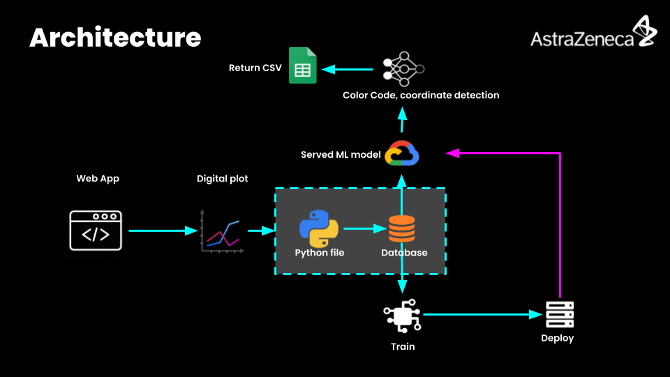

## Astra Zeneca Hack 2021

<p align="center">
  
</p>

* Reverse engineer Kaplan-Meier (KM) plots from
scientific literature and digitize them into probabilistic raw data points.	View our [Pitch deck](https://github.com/Sai-Adarsh/astra-hacks/blob/master/docs/deck/pitchdeck.pdf) here.


### ☀️ Run Flask Server

* Create a virtualenv and activate:
  ```bash
  $ virtualenv venv && source venv/bin/activate
  ```
* Install python dependencies
  ```bash
  $ pip install -r requirements.txt
  ```
* Run
  ```bash
  $ python app.py
  ```
* The application will be accessible at `http://localhost:5000`

### ☀️ Deploy

* You can deploy your own copy of the API using this button:

[](https://heroku.com/deploy)

### ☀️ Architecture

<p align="center">
  
</p>

### ❤️ Authors

* Sai Adarsh S., Rajasekar M., Akash C.